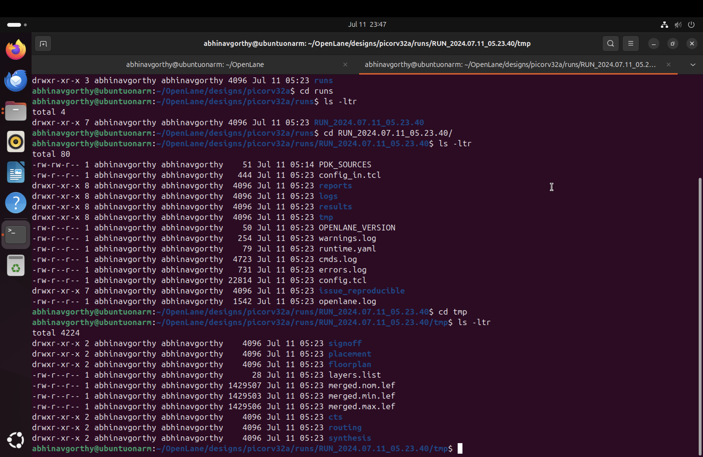

# NASSCOM Digital VLSI SoC Design and Planning 

I discovered this workshop on LinkedIn through Kunal Ghosh. It’s a two-week course on Digital SoC and Physical Design using Open Lane, a platform that employs open-source tools to create digital designs from RTL to GDSII. The workshop utilizes the SkyWater 130 open-source PDK.

## Aim of the Workshop 
The workshop focuses on the physical design of a macro CPU core called picorv32a, which is part of the VSD Squadron ICs developed by VLSI System Design (VSD). This development board, based on the RISC-V architecture, is similar to Arduino Uno boards and is suitable for applications in home automation, IoT, and more.

### Image of VSDSQUADRON Mini (Source : VLSI System Design)



### Overview of Chip Making 


### Agenda of the workshop 


## Day 1: Inception of open-source EDA, OpenLane and Sky130 PDK 

### SOC: System on Chip 

- SoC is an Integrated Circuit that consists of all the key components like Memory, Logic, Cache on a single IC which decreases the system area and improves the area and power.
- Architecture is crucial for a SoC or any other ASIC. Most of the SOCs follow ARM architecture while the traditional computers follow x86 and x64 architecture which are proprietary, and licenses are required to purchase them. In this workshop we focused on an open-source ISA (Instruction Set Architecture) called RISC -V which was developed by UC Berkeley in 2010 and became famous among the researchers as an industry expert. It is one of the fastest-growing ecosystems and uses smaller instruction set for better computation and efficiency in terms of Performance, Power, and Area.

### Foundry Intellectual Property (IPs):

- Few of the components in an SoC needs some assistance and constant interaction with the semiconductor fabrication unit or foundry and those are termed as Foundry IPS (Example: SRAM, PLL, ADC and DAC)
- IPs can be licensed from IP vendors or developed in-house (Example: Micron -DRAM)
- They provide a level of abstraction that allows designers to focus on higher-level design hiding the internal information.

### Macros 
- Components which are reusable components and classified into three main categories soft macro, firm macro and hard macro.
- Soft Macro: Synthesizable, flexible and editable
- Firm Macro: Have a Netlist Format, portable and have predictive PPA.
- Hard Macro: Same as Foundry IPs and have optimized PPA and timing

### Software  and Hardware Integration 

All the applications interact with the ICs and perform tasks as per the user requirements. The system software is responsible for translating the application program into binary language, which the hardware can understand and execute. The three main layers of the system software are. 
#### 1) Operating System (OS): MacOS, Windows, Linux
- Handle IO Operations 
- Process and Memory Management
- Interrupt Handling 
 #### 2) Compiler (Gcc, Clang) 
- Converts the high-level language into an executable file in assembly -level instructions and later sent to an Assembler.
-  Different architectures have their own instruction sets, and the compiler ensures that the instructions generated are compatible with the targeted architecture.

#### 3) Assembler
- It converts the assembly level language into binary code, which is a sequence of 0s and 1s that can be directly dumped into the hardware.
- Hardware Descriptive Languages like (Verilog, VHDL) also interact with assembler

### Open-Source Digital ASIC Design 

#### 1)  RTL Design: Register Transfer Level refer to pre-designed and pre-verified digital hardware components or blocks that are described at the Register Transfer Level (RTL). It is an HDL representation of a digital circuit or a portion of a circuit. 
#### 2)  EDA tools: Electronic Design Automation Tools are software applications which are used in design, simulation, analysis, automate the process of chip making which increase efficiency and reduce time-to-market aspects.
#### PDKs : Process Design Kits are set of files which are basically model files provided by the foundry that abides all the rules of fabrication and used by the circuit designers to develop an analog, digital and mixed signal designs. It acts a bridge between the semiconductor fabrication engineers and circuit designers. 

These three can have limited access and most of them have licenses. However, there are many designs, tools and pdks that are open source, and we will be using these open-source tools and files to generate a cpu core. 

### OPENLANE EDA Tools (RTL to GDSII)  
 OpenLane is an automated RTL to GDSII flow based on several tools. It provides a number of custom scripts for design exploration and optimization. The flow performs all ASIC implementation steps from RTL all the way down to GDSII. Currently, it supports both A and B variants of the sky130 PDK, the C variant of the gf180mcu PDK.

Github Repo
``` bash 
 https://github.com/The-OpenROAD-Project/OpenLane
 ```
The advantage of OpenLane is it is user friendly, and we can modify the behavior of the circuit with a single configuration file. 

Installation of Linux on MacOS (Apple Silicon) 
- Oracle Virtual Box is not compatible with the latest apple silicon chips of Apple (M Series) and thus I used UTM for MacOS to install Ubuntu.
- I followed the video to install the Ubuntu: 
``` bash  
https://youtu.be/O19mv1pe76M?feature=shared
``` 
- To install openlane I followed the instructions mentioned in the git hub repo 

```bash
  https://github.com/AnupriyaKrishnamoorthy/NASSCOM-PD-ANU. 
```
- They mentioned to install the following dependencies and packages along with the PDKS listed below:
``` bash 
sudo apt-get update
sudo apt-get upgrade
sudo apt install -y build-essential python3 python3-venv python3-pip make git
``` 
- In order to interact with OpenLane Docker has to be installed and for that run the following commands :
``` bash 
sudo apt install apt-transport-https ca-certificates curl software-properties-common
curl -fsSL https://download.docker.com/linux/ubuntu/gpg | sudo gpg --dearmor -o /usr/share/keyrings/docker-archive-keyring.gpg
echo "deb [arch=amd64 signed-by=/usr/share/keyrings/docker-archive-keyring.gpg] https://download.docker.com/linux/ubuntu $(lsb_release -cs) stable" | sudo tee /etc/apt/sources.list.d/docker.list > /dev/null
sudo apt update
sudo apt install docker-ce docker-ce-cli containerd.io
sudo docker run hello-world
``` 
- If the above command executes it means that the docker is successfully installed 
- Run some additional commands for global usage of docker 
 ``` bash 
sudo groupadd docker
sudo usermod -aG docker $USER
sudo reboot  
# Check for successful installation
sudo docker run hello-world 
``` 
- These are the steps to install the OpenLane: 
``` bash 
git clone https://github.com/The-OpenROAD-Project/OpenLane --recurse-submodules 
cd OpenLane
make
make test
cd $HOME/OpenLane/designs/ci
cp -r * ../
``` 
- After make and make test you see all the tools pass the basic test. 
### Openlane Open PDKs install  
- This link directs to the installation of Open PDKs 
 ``` bash 
 https://web02.gonzaga.edu/faculty/talarico/vlsi/openpdk.html
 ``` 
- Make sure you install magic, ngspice and other required tools directly using sudo apt install <tool_name> and run its corresponding make file or  gcc file.

### Lab Exercise: 
- Steps to run synthesis in OpenLane Interactive mode:
``` bash 
cd ~/OpenLane
make mount
./flow.tcl -interactive
package require openlane 0.9
prep -design picorv32a
run_synthesis
```
- To view the netlist, go to the runs and look into the results of the latest run that you performed. 
A sample command is shown here : 
``` bash 
cd /home/OpenLane/designs/picorv32a/runs/RUN_1/results/synthesis
vim picorv32a.v
``` 
- Reports can be viewed in the reports folder.
 - AREA_0 Report:  
 - Synthesized Verilog file: 

## Day 2: Good Floorplan Vs Bad Floorplan and Introduction to Library Cells

### Floor Planning and Power Planning Key Concepts: 
##### Defining the width and height of the cell

- 	Die Area: A small square area on which chip is fabricated that of consists core area and IO pads.
- Core Area: Main area where standard cells, macros/IPs are placed. 
- 	Core Utilization Factor: (Area Occupied by Netlist / Total Area of the core)
- Aspect Ratio: Height/ Width of the Core.
 Defining locations of Pre-placed Cells
 -  The pre-placed cells are typically IPs that have defined before automated PnR (Place and Route)
- 	Circuit Bipartitioning occurs and organized into blocks/modules and placed along with the pre-placed cells. 
-  Surround the pre-placed cells with decoupling capacitors.
- Decoupling capacitors are large capacitors that store electrical charge They act as reservoirs can send same voltage as power supply to the circuit for a period. 
- Some pre-placed cells reside far away from the Power supply and toa void  IR drop De Caps are used. 
Power Planning: 

-	Its aim is to supply power evenly to all the circuits and the plan the distribution of power and ground connections to ensure proper functionality and performance of the chip. 
-  Due to the internal parasitics, hazards (Harmful Glitches) like voltage droop and ground bounce occurs when there are variations in the voltage levels of different GND points due to transient currents. 
- Mesh Distribution Startegy is usually preferred in power planning.
Pin Placement :
- Proper Pins must be allocated according to the floor planning in such a way that the input and output signals are strong with equal power distribution to all the cells along with standard packaging aspects.
- Create a blockage ring in between the core and IO pads to avoid crosstalk.
 Placement
- After all these, Placement is performed based on algorithms that minimize wirelength. 

 ### Lab Exercise: 
A simple command is required to perform the floorplanning 
 ``` bash 
run_floorplan
 ```
Floor Planning DEF File 

- To view floorplan the following command is required. Make sure you copy the tech file (sky130A.tech) file into the existing directory or you can copy the path of the technology file. Lef (Library Exchange Format) is read to view the layout 
``` bash 
$ cd /home /OpenLane/designs/picorv32a/runs/RUN_1/results/floorplan
$ magic -T sky130A.tech lef read ../../tmp/merged.nom.lef def read picorv32a.def &
``` 
- There are many commands that are used in the magic tkcon command window 
- Once such example is selecting the area of the required portion and typing what and in this case, it shows two different metal layers that are used in the floorplanning.

Run Placement :
``` bash 
 run_placement
 ```
- To view the placement use the following commands 
 ``` bash 
 $  cd /home /OpenLane/designs/picorv32a/runs/RUN_1/results/placement
$ magic -T sky130A.tech lef read ../../tmp/merged.nom.lef def read picorv32a.def &
```
- Inorder to insert a custom cell design into the existing flow we need to install the following package 
``` bash 
git clone https://github.com/nickson-jose/vsdstdcelldesign.git
```
- To view the layout of a basic inverter 
 ``` bash 
 magic -T ./libs/sky130A.tech sky130_inv.mag &
 ``` 
 ### Cell Design and Characterization Flow 

Library is a file where all the information of a different cells.

Cell Design Flow Key Concepts for EDA tools: 

Inputs:
 - PDKs
- 	Design Rule Checks (DRC), Layout vs Schematic (LVS) 
- 	SPICE- Models, library & user-defined specs
Design Steps and Outputs 
-	Circuit design 
-	 Layout design & characterization: Using Euler’s path and stick diagram (LEF output)
- Extraction of parasitics, extraction of spice netlist (GDS II, .cir , .lib  output files)

Standard Cell Characterization Flow Key Concepts for Spice Deck:
- Read the models and tech file that have parameters, equations (device physics) 
-  Read extracted spice Netlist
-	Recognize the   behavior of the netlist. 
- Input the model file of the subcircuits
- Attach the required power supply and name the nodes.
- 	Apply inputs (PULSE, PWL).
-	Apply Capacitive Load.
- Provide neccesary simulation commands in Spice Deck (.tran . dc) 

After all these 8 steps, the information is sent to a Software called GUNA and generates the timing, noise power models for these files. We characterize Timing,Power and noise.

### Timing Characterization:  

## Day 3: Design Library Cell Using Magic Layout and ngspice characterization.

IO placer: Even after running the placement we can change the parameters and observe the places.I observed that the change in the ports when I changed the value of IO placer which is not equidistant from each other as in the previous case.

- Spice Deck Order, Syntax and Semantics: 

CMOS Inverter Robustness Checks for Spice Deck:
We can change the load capacitance, width of pmos and nmos and compare the results. 
- One of the important parameters is the Switching Threshold (Vm) a point at which Vin = Vout and when both are in Saturation region.

### Lab exercise: 
Inorder to get the inverter (Custom) files we need to clone a repository.
``` bash 
git clone https://github.com/nickson-jose/vsdstdcelldesign.git
``` 
For viewing the layout 
``` bash 
magic -T ./libs/sky130A.tech sky130_inv.mag &

``` 

CMOS is called as Complementary Metal Oxide semiconductor, and it is most widely used technology in digital ICs and it is fabricated using 16 steps.
- 1.  Substrate Preparation
- 2. N-Well Formation
- 3. P-Well Formation
- 4. Gate Oxide Deposition
- 5. Poly-Silicon Deposition
- 6. Poly-Silicon Masking and Etching
- 7. N-Well Masking and Implantation
- 8. P-Well Masking and Implantation
- 9. Source/Drain Implantation
- 10. Gate Formation
- 11. Source/Drain Masking and Etching
- 12. Contact/Via Formation
- 13. Metal Deposition
- 14. Metal Masking and Etching
- 15. Passivation Layer Deposition
- 16. Final Testing and Packaging
Generation of Spice Model from Magic Layout 
It includes design rules (tech LEF) and abstract information about the cells.
Layout Designer converts the layout to LEF format to avoid the disclosure of logic inside the standard cell and make is easy for the physical design engineers.
In the tkcon window we need to convert the layout to spice file 
extract all
ext2spice cthresh 0 rthresh 0 
ext2spice
cthreshold 0 and rthresh 0 ensure that the RC values are zero.
Modify the existing spice to this: 
``` bash 
* SPICE3 file created from sky130_inv.ext - technology: sky130A
.option scale=0.01u
.include ./libs/pshort.lib
.include ./libs/nshort.lib
//.subckt sky130_inv A Y VPWR VGND
M1000 Y A VGND VGND nshort_model.0 w=35 l=23
+  ad=1.44n pd=0.152m as=1.37n ps=0.148m
M1001 Y A VPWR VPWR pshort_model.0 w=37 l=23
+  ad=1.44n pd=0.152m as=1.52n ps=0.156m

VDD VPWR 0 3.3V
VSS VGND 0 0V
Va A VGND PULSE(0V 3.3V 0 0.1ns 0.1ns 2ns 4ns)
C0 A VPWR 0.0774f
C1 VPWR Y 0.117f
C2 A Y 0.0754f
C3 Y VGND 2f
C4 A VGND 0.45f
C5 VPWR VGND 0.781f
//.ends
.tran 1n 20n
.control
run
.endc
.end
``` 
Use the following command in the Ngspice Shell:
``` bash 
 ngspice sky130_inv.spice 
 ``` 

### Lab Exercise on DRC Check: 
The Open-source community will be updating constantly and different versions will be still under development and this exercise aim is to understand the Magic Layout DRC engine.
Download the package using the command: 
``` bash 
wget http://opencircuitdesign.com/open_pdks/archive/drc_tests.tgz
``` 
-  DRC check for poly.mag
DRC ERROR COUNT = 32  

- Edit the drc_tests file by adding the allpolynonres to update the design rule check  based on the Skywater 130 PDK design rules information from Open Circuit Design.


- Similarly include DRC line  for the npres as above: 

``` bash 
spacing npres allpolynonres 480 touching_illegal \
                    "poly.resistor spacing to N-tap < %d (poly.9)" 


``` 
- We can observe the increase in the DRC count which indicates that the DRC rules are correctly implemented. 
DRC ERROR COUNT = 45

- DRC Next Error for n well used in FEOL   
- Make the following changes in the changes in the DRC tests.

Drc Errors solved 

## Day 4: Timing Analysis and Clock Tree Synthesis (CTS)

### LEF EXTRACTION : 
Tracks and Trunks: The horizontals and vertical lines or paths on which a metal layer is drawn for routing. Width and Height of standard cell are defined in lambda units of Horizontal track pitch and Vertical trunk pitch. 
- Adjusting Grid (Lamda): 
``` bash 
grid 0.46um 0.34um 0.23um 0.17um
```
Port Creation: 
- Select Ports for LEF :

``` bash 
Port A:  port class input
                port use signal 
Port Y: port class output
               port use signal
VPWR : port class inout
                port use power
VGND: port class inout
               port use ground
``` 
Generate LEF:
``` bash
lef write 
```
This generates sky130_vsdinv.lef file

Make sure you have all the required files (.lib, .lef, .v files) like below

Lef file: 

### Steps to include custom cell to the existing design
Modify the existing tcl file to 
Use the following commands in the openlane interactive mode 
``` bash 
prep -design picorv32a -tag RUN_2024.05.21_05.21.00 -overwrite 
set lefs [glob $::env(DESIGN_DIR)/src/*.lef]
add_lefs -src $lefs
run_synthesis
``` 


After Running synthesis
STA log 
Run_floorplan : If error occurs use step by step approach instead of run_floorplan
``` bash 
% init_floorplan
% place_io
% tap_decap_or 
``` 
### Delay Tables Key concepts
- In CTS, Using H tree Algorithm Repeaters/buffers are used to make that the skew is minimized.
- Delay of cells mostly depends on input transition and output load. 
- During CTS, different input slew and output load are organized in a delay table with different buffer sizes. 
- The tool uses some equations and ensures same load at each node by replacing different buffers with different input slew

Placement after sky130_vsdinv
``` bash 
% run_placement
% magic -T sky130A.tech lef read ../../tmp/merged.nom.lef def read results/floorplan/picorv32a.def &
``` 
The above placement consists of 145 sky130_vsdinv cells.

### Static Timing Analysis Key Concepts: 
-	Setup Time: Minimum amount of time required for the data to be stable before the active edge of the clock to get properly captured. 
- Setup slack: Data Required Time - Data Arrival Time
- Setup Analysis with Idea Clock: 
- Library Setup time (S) : Time it takes for MUX 1 to pass to the center of the capture flop.
- Setup Uncertainity (SU) : This occurs due to Clock Jitter (Clock may arrive a bit late/early)
- Hold time: Minimum amount of time required for the data to be stable after the active edge of the clock to get properly captured. It takes time for capture flop to send data from center of the flip flop through MUX 2 to the next cell/flop.
- Hold slack: Data Arrival  Time - Data Required Time
-  Hold Timing Analysis with Ideal Clocks: 

### Lab exercise: OpenSTA software 
``` bash 
sta pre_sta.conf 
``` 
- For this, pre_sta.conf is required to carry out the STA analysis. 
- Invoke OpenSTA outside the openLANE flow as follows, 
Slack Violation after many attempts of changing  cells and strategies :
- Attempt 1: SLACK MET
- Attempt 2: Slack MET 
### Clock Tree Synthesis:
- Setup Timing Analysis with Real Clocks (Buffers are added and Clock skew is introduced): 
- 	Hold Time Analysis with Real Clocks (Buffers are added and Clock skew is introduced): 
Clock Tree Synthesis Key Concepts: 

-	CTS is an important step that ensures that all the cells reaches the clock at almost same time.
-	It has some quality checks like slew, pulse width, latency, duty cycle, signal integrity and so on. Using algorithms like H-tree which is particularly effective for distributing clock signals across large chip areas. The hierarchical structure can help reduce clock skew and optimize power consumption.
- Crosstalk: Crosstalk is one of the biggest problems especially at lower nodes due to the high integration density of components on a chip. Since clock is the important part for the whole circuitry it is important to shield it and protect it from glitches and hazards.

### Lab exercise 
CTS RUN:
``` bash 
run_cts 
```
- Use Openroad software and the following commands to meet the timing constraints
``` bash 
openroad
read_lef <path of merge.nom.lef>
read_def <path of def>
write_db pico_cts.db
read_db pico_cts.db
read_verilog /home/OpenLane/designs/picorv32a/runs/RUN_1/results/synthesis/picorv32a.v
read_liberty $::env(LIB_SYNTH_COMPLETE)
read_sdc /home/OpenLane/designs/picorv32a/src/base.sdc
set_propagated_clock (all_clocks)
report_checks -path_delay min_max -format full_clock_expanded -digits 4
``` 
Hold Slack MET:
Setup Slack Met: 

## Day 5: Final steps for RTL 2 GDSII using TritonRoute
### Routing Key Concepts: 
- Routing follows various algorithms and one among them is Lee Maze Algorithm that starts propagating like a wave and reaches the target and then back tracing is performed where a metal layer is routed from one point to another and then it acts like a blockage to the next routing step.
- 	The Triton Route uses MILP (Mixed Integer Linear Programming : Panel Routing Concept) consists of two distinct routes, Fast Route – only between two layers and Detailed Route – intra layers.

- Power Distribution Network 
Run the following command 
``` bash
gen_pdn
``` 
### Routing 
For routing these are the following files 
Inputs : LEF, DEF, Preprocessed route guides
Output : Detailed routing solution with optimized wire length and via count ( observed in MAGIC layout) 
``` bash
run_routing 
 ```
The Wire length is 1712160980 
Layout After Routing 
``` bash 
magic -T  sky130A.tech lef read ../../tmp/merged.nom.lef def read results/routing/picorv32a.def &
```


Summary of Entire Flow:

 
##  Acknowledgements

I would like to thank Mr. Kunal Ghosh for sharing this workshop and I would like extend thanks to the Github OpenLane community.

## References 
 - [https://github.com/The-OpenROAD-Project/OpenLane](https://github.com/The-OpenROAD-Project/OpenLane)
 - [https://github.com/nickson-jose/vsdstdcelldesign](https://github.com/nickson-jose/vsdstdcelldesign)
 - [https://github.com/AnupriyaKrishnamoorthy/NASSCOM-PD-ANU/tree/main](https://github.com/AnupriyaKrishnamoorthy/NASSCOM-PD-ANU/tree/main)


